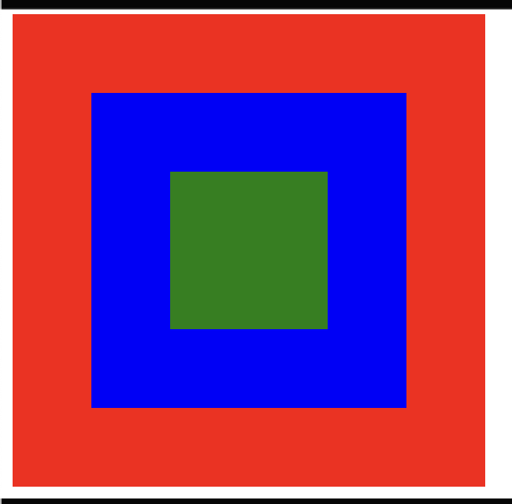

```
HTML :-
<!DOCTYPE html>
<html lang="en">
  <head>
    <meta charset="UTF-8" />
    <meta http-equiv="X-UA-Compatible" content="IE=edge" />
    <meta name="viewport" content="width=device-width, initial-scale=1.0" />
    <title>Document</title>
    <script src="script.js" defer></script>
  </head>
  <body>
    <div class="grandparent">
      <div class="parent">
        <div class="child"></div>
      </div>
    </div>
  </body>
</html>
```



```
CSS ---
.grandparent {
  width: 300px;
  height: 300px;
  background: red;
  position: relative;
}

.parent {
  width: 200px;
  height: 200px;
  background: blue;
  position: absolute;
  inset: 0;
  margin: auto;
}

.child {
  width: 100px;
  height: 100px;
  background: green;
  position: absolute;
  inset: 0;
  margin: auto;
}

```

### Event Bubbling

```
JS ---
const grandparent = document.querySelector(".grandparent")
const parent = document.querySelector(".parent")
const child = document.querySelector(".child")

grandparent.addEventListener("click", (e) => {
// console.log(e.target)
console.log('grandparent 1')
})

parent.addEventListener("click", (e) => {
// console.log(e.target)
console.log('parent 1')
})

child.addEventListener("click", (e) => {
// console.log(e.target)
console.log('child 1')
})
```

- When we click on red box, it will print **grandparent 1**.
- When we click blue box, it logs **grandparent 1, parent 1**.
- When we click green box, it logs **grandparent 1, parent 1, child 1**.

- This is event bubbling and default behaviour of events on elements. Event propogates from inner most element towards outer elements (from child, to parent and to grandparent.)

### Event Capturing

```
JS ---
const grandparent = document.querySelector(".grandparent")
const parent = document.querySelector(".parent")
const child = document.querySelector(".child")

grandparent.addEventListener("click", (e) => {
// console.log(e.target)
console.log('grandparent 1')
}, { capture: true })

parent.addEventListener("click", (e) => {
// console.log(e.target)
console.log('parent 1')
})

child.addEventListener("click", (e) => {
// console.log(e.target)
console.log('child 1')
})
```

- If you click on the child (green box) then it logs **Grandparent 1, Child 1, Parent 1, Document 1**

### Reason

- **grandparent 1** is in capture phase, hence it gets logged 1st
- then we capture **parent 1**, but no (capture event), hence skips printing.
- then we capture **child 1**, but no (capture event), hence skips printing.
- now it triggers event bubbling and print **Child 1**
- then it triggers event bubbling for parent and prints **parent 1**
- then it bubbles for grandparent 1(but since already in capture phase) , so it skips bubbling
- then it bubbles for document 1 and logs document 1

Ref - https://github.com/saiteja-organization-topmate/interview-prep-topmate/blob/main/js/JS_Advanced_Concepts/46_Event%20Listeners.md

### Example 2 (Suppose if we want to stop propagation after Parent)

- when we add e.stopPropogation(), it stops whole capturing and bubbling event for all elements down the tree from there onwards ie element in which
  stopPropogation is added. It logs till the element in which propogation is added.

````const grandparent = document.querySelector(".grandparent")
const parent = document.querySelector(".parent")
const child = document.querySelector(".child")

grandparent.addEventListener(
  "click",
  (e) => {
    console.log("Grandparent Capture")
  },
  { capture: true }
)

grandparent.addEventListener("click", (e) => {
  console.log("Grandparent Bubble")
})

parent.addEventListener(
  "click",
  (e) => {
    e.stopPropagation() // Added this line
    console.log("Parent Capture")
  },
  { capture: true }
)

parent.addEventListener("click", (e) => {
  console.log("Parent Bubble")
})

child.addEventListener(
  "click",
  (e) => {
    console.log("Child Capture")
  },
  { capture: true }
)

child.addEventListener("click", (e) => {
  console.log("Child Bubble")
})

document.addEventListener(
  "click",
  (e) => {
    console.log("Document Capture")
  },
  { capture: true }
)

document.addEventListener("click", (e) => {
  console.log("Document Bubble")
})```
````

- this logs, Document Capture, Grandparent Capture, Parent Capture and then stops propogation further onwards.
- When we add stopPropagation in bubble event, then it will log from child towards parents. If there is capture also, it will log capture but will stop bubbling after the element on which bubbling is used.

- With bubbling, the event is first captured and handled by the innermost element and then propagated to outer elements.
- With capturing, the event is first captured by the outermost element and propagated to the inner elements.
- Event bubbling and capturing occurs when element inside other elements are registered with event handlers.
